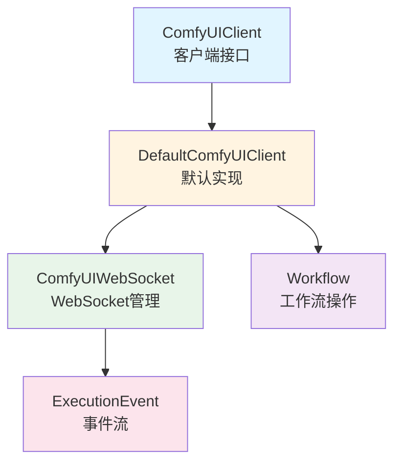
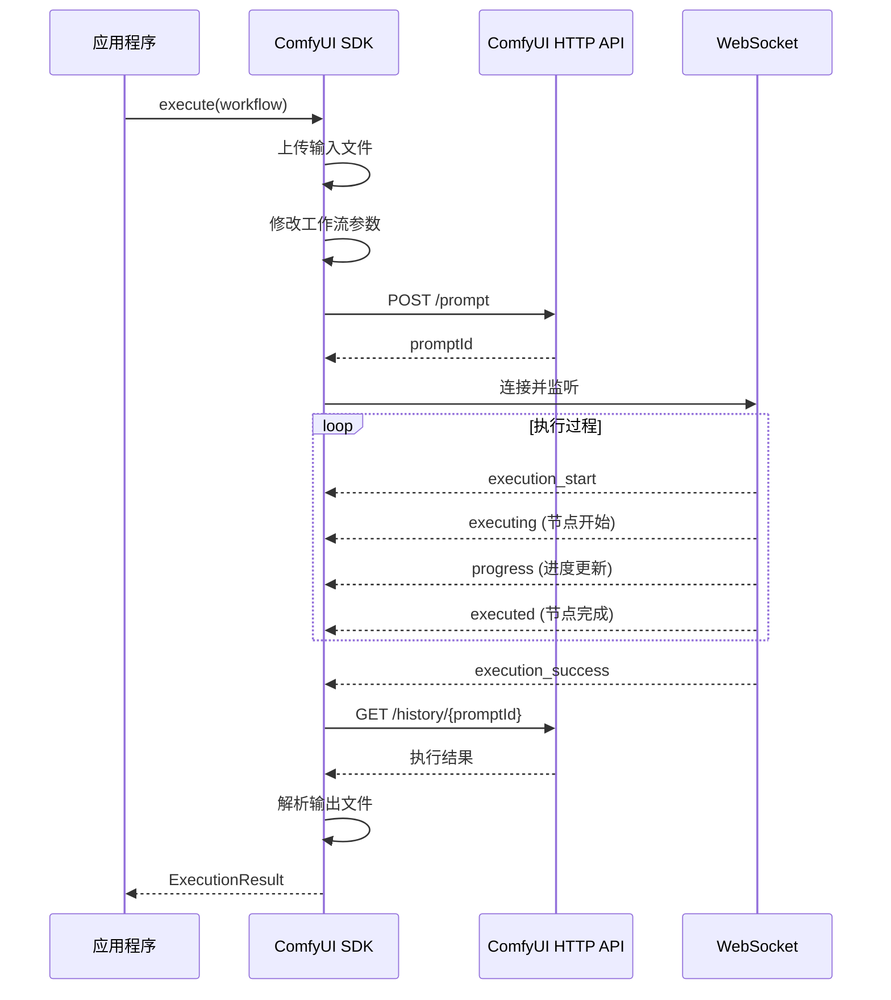
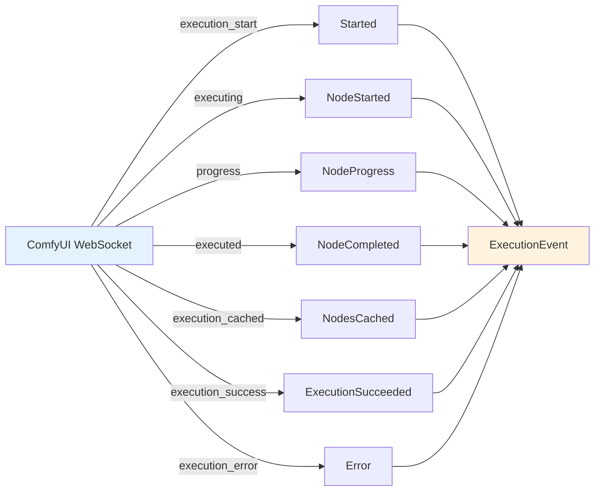

# Convention4j ComfyUI SDK

一个用于与 [ComfyUI](https://github.com/comfyanonymous/ComfyUI) 进行交互的 Java SDK，提供类型安全的 API 来执行 ComfyUI 工作流。

## 功能特性

- ✅ **异步非阻塞**: 支持响应式和同步两种调用方式
- ✅ **实时进度监听**: 获取工作流执行的实时事件流
- ✅ **动态工作流操作**: 修改提示词、种子、Checkpoint 等参数
- ✅ **多类型文件支持**: 上传/下载图像、音频、视频等多种文件类型
- ✅ **超时控制**: 防止任务无限等待
- ✅ **自动资源管理**: 支持 try-with-resources
- ✅ **类型安全**: 强类型 API，编译期检查
- ✅ **异常分层**: 清晰的异常体系便于错误处理

## 快速开始

### Maven 依赖

```xml
<dependency>
    <groupId>fun.fengwk.convention4j</groupId>
    <artifactId>convention4j-comfyui</artifactId>
    <version>1.2.0</version>
</dependency>
```

### 基础使用

```java
// 1. 创建客户端工厂
ComfyUIClientFactory factory = new ComfyUIClientFactory();

// 2. 创建客户端（支持 try-with-resources 自动关闭）
try (ComfyUIClient client = factory.create("http://localhost:8188")) {
    
    // 3. 加载工作流（从 ComfyUI 导出的 API 格式 JSON）
    String workflowJson = Files.readString(Paths.get("workflow.json"));
    Workflow workflow = Workflow.fromApiJson(workflowJson);
    
    // 4. 执行工作流
    ExecutionResult result = client.execute(workflow).block();
    
    // 5. 处理结果
    if (result.isSuccess()) {
        System.out.println("执行成功！Prompt ID: " + result.getPromptId());
        
        // 获取所有图像输出
        for (OutputFile image : result.getImages()) {
            byte[] imageData = client.getFile(image).block();
            Files.write(Paths.get(image.getFilename()), imageData);
        }
    }
}
```

## 核心概念

### 1. 工作流 (Workflow)

工作流是 ComfyUI 的核心概念，定义了图像生成的完整流程。

#### 加载工作流

```java
// 从 API 格式 JSON 加载（推荐）
Workflow workflow = Workflow.fromApiJson(jsonString);

// 从文件加载
String json = Files.readString(Paths.get("workflow.json"));
Workflow workflow = Workflow.fromApiJson(json);
```

**重要**: 必须使用 ComfyUI 的 "Save (API Format)" 导出工作流，不是普通的 "Save" 格式。

#### 修改工作流参数

```java
// 设置提示词
workflow.setPrompt("6", "a beautiful landscape");

// 设置负面提示词
workflow.setNegativePrompt("7", "bad quality");

// 设置 checkpoint
workflow.setCheckpoint("4", "v1-5-pruned-emaonly.ckpt");

// 设置种子
workflow.setSeed("3", 123456789L);

// 随机化所有种子
workflow.randomizeSeed();

// 设置文件输入（自动检测节点类型：LoadImage/LoadAudio/LoadVideo）
workflow.setFileInput("4", "input.png");    // LoadImage 节点
workflow.setFileInput("47", "audio.mp3");   // LoadAudio 节点
workflow.setFileInput("5", "video.mp4");    // LoadVideo 节点

// 通用属性设置
workflow.setProperty("3", "inputs/steps", 20);
```

### 2. 客户端配置

```java
ComfyUIClientOptions options = ComfyUIClientOptions.builder()
    .baseUrl("http://localhost:8188")
    .apiKey("your-api-key")  // 可选
    .connectTimeout(Duration.ofSeconds(10))
    .readTimeout(Duration.ofSeconds(30))
    .websocketTimeout(Duration.ofMinutes(30))
    .build();

ComfyUIClient client = factory.create(options);
```

### 3. 执行选项

```java
ExecutionOptions options = ExecutionOptions.builder()
    // 随机化种子
    .randomizeSeed(true)
    
    // 输入文件（自动根据 MIME 类型推断类型）
    .inputFiles(List.of(
        InputFile.image("photo.png", imageData, "image/png"),
        InputFile.audio("music.mp3", audioData, "audio/mpeg"),
        InputFile.video("clip.mp4", videoData, "video/mp4")
    ))
    
    // 文件节点 ID 列表（与 inputFiles 一一对应）
    .fileNodeIds(List.of("4", "47", "5"))
    
    // 执行监听器（实时进度回调）
    .listener(new ExecutionListener() {
        @Override
        public void onNodeProgress(String nodeId, int current, int total) {
            System.out.printf("Node %s: %d/%d%n", nodeId, current, total);
        }
    })
    
    // 执行超时（重要！防止无限等待）
    .timeout(Duration.ofMinutes(5))
    
    .build();

ExecutionResult result = client.execute(workflow, options).block();
```

### 4. 实时事件流

使用事件流可以实时获取执行进度：

```java
client.executeWithEvents(workflow)
    .doOnNext(event -> {
        switch (event) {
            case ExecutionEvent.Started started -> 
                System.out.println("开始执行: " + started.promptId());
                
            case ExecutionEvent.NodeStarted nodeStarted -> 
                System.out.println("节点开始: " + nodeStarted.nodeId());
                
            case ExecutionEvent.NodeProgress progress -> 
                System.out.printf("进度: %d/%d%n", progress.current(), progress.total());
                
            case ExecutionEvent.NodeCompleted completed -> 
                System.out.println("节点完成: " + completed.nodeId());
                
            case ExecutionEvent.Completed completed -> 
                System.out.println("全部完成");
                
            case ExecutionEvent.Error error -> 
                System.err.println("错误: " + error.message());
                
            default -> {}
        }
    })
    .blockLast();
```

### 5. 处理输出

```java
ExecutionResult result = client.execute(workflow).block();

// 获取所有输出
List<OutputFile> allOutputs = result.getOutputs();

// 按类型获取
List<OutputFile> images = result.getImages();
List<OutputFile> videos = result.getVideos();
List<OutputFile> audios = result.getAudios();

// 按节点获取
Optional<NodeOutput> nodeOutput = result.getNodeOutput("8");
nodeOutput.ifPresent(output -> {
    // 获取文件
    List<OutputFile> files = output.getFiles();
    
    // 获取文本输出
    List<String> texts = output.getText();
    
    // 获取数值输出
    List<Number> values = output.getValue();
});

// 下载文件
for (OutputFile file : images) {
    byte[] data = client.getFile(file).block();
    Files.write(Paths.get(file.getFilename()), data);
}
```

## 实现原理

### 架构设计



### 执行流程



### WebSocket 事件映射



## 高级用法

### 1. 便捷的上传并设置方法

SDK 提供了自动上传文件并设置到工作流节点的便捷方法：

```java
// 单个文件：自动上传 + 设置节点
Workflow updatedWorkflow = client.uploadAndSetFile(
    workflow,
    "4",                    // 节点ID
    "photo.png",            // 文件名
    imageData,              // 文件数据
    "image/png"            // MIME类型
).block();

// 批量文件：自动上传 + 批量设置
List<InputFile> files = List.of(
    InputFile.image("photo.png", imageData, "image/png"),
    InputFile.audio("music.mp3", audioData, "audio/mpeg")
);
List<String> nodeIds = List.of("4", "47");

Workflow updatedWorkflow = client.uploadAndSetFiles(workflow, files, nodeIds).block();

// 然后直接执行
ExecutionResult result = client.execute(updatedWorkflow).block();
```

### 2. 多类型文件输入

SDK 支持图像、音频、视频等多种类型的文件输入：

```java
// 使用工厂方法创建特定类型的输入文件
InputFile imageFile = InputFile.image("input.png", imageBytes, "image/png");
InputFile audioFile = InputFile.audio("bgm.mp3", audioBytes, "audio/mpeg");
InputFile videoFile = InputFile.video("clip.mp4", videoBytes, "video/mp4");

// 或使用构造器（根据 MIME 类型自动推断）
InputFile autoDetect = new InputFile("file.png", data, "image/png"); // 自动识别为 IMAGE

// 配置执行选项（inputFiles 和 fileNodeIds 一一对应）
ExecutionOptions options = ExecutionOptions.builder()
    .inputFiles(List.of(imageFile, audioFile, videoFile))
    .fileNodeIds(List.of("4", "47", "5"))  // 与 inputFiles 顺序对应
    .build();

// 执行工作流
client.execute(workflow, options).block();
```

**工作流中设置文件输入：**

```java
// 使用通用方法（自动检测节点类型）
workflow.setFileInput("4", "input.png");   // LoadImage 节点
workflow.setFileInput("47", "audio.mp3");  // LoadAudio 节点
workflow.setFileInput("5", "video.mp4");   // LoadVideo 节点
```

**支持的文件类型和节点：**

| 文件类型 | 节点类型 | MIME 类型示例 |
|---------|---------|--------------|
| IMAGE | LoadImage | image/png, image/jpeg |
| AUDIO | LoadAudio | audio/mpeg, audio/wav |
| VIDEO | LoadVideo | video/mp4, video/avi |

### 3. 自定义 HttpClient

```java
HttpClient customClient = HttpClient.newBuilder()
    .connectTimeout(Duration.ofSeconds(30))
    .build();

ComfyUIClientFactory factory = new ComfyUIClientFactory(customClient);
```

### 4. 批量处理

```java
List<String> prompts = List.of("prompt1", "prompt2", "prompt3");

Flux.fromIterable(prompts)
    .flatMap(prompt -> {
        Workflow wf = workflow.copy();
        wf.setPrompt("6", prompt);
        return client.execute(wf);
    })
    .collectList()
    .subscribe(results -> {
        System.out.println("完成 " + results.size() + " 个任务");
    });
```

### 5. 错误处理

```java
client.execute(workflow)
    .onErrorResume(ExecutionException.class, e -> {
        log.error("执行失败", e);
        return Mono.empty();
    })
    .doOnError(WorkflowException.class, e -> {
        log.error("工作流错误", e);
    })
    .block();
```

## 异常处理

SDK 定义了以下异常类型：

- `ComfyUIException`: 基础异常类
  - `ExecutionException`: 执行相关异常（超时、任务失败等）
  - `WorkflowException`: 工作流相关异常（解析失败、节点不存在等）

```java
try {
    ExecutionResult result = client.execute(workflow).block();
} catch (ExecutionException e) {
    // 处理执行异常
    log.error("执行失败: {}", e.getMessage());
} catch (WorkflowException e) {
    // 处理工作流异常
    log.error("工作流错误: {}", e.getMessage());
} catch (ComfyUIException e) {
    // 处理其他异常
    log.error("ComfyUI 错误: {}", e.getMessage());
}
```

## 资源管理

SDK 实现了 `Closeable` 接口，**必须**正确关闭客户端以释放资源：

```java
// 推荐方式：使用 try-with-resources
try (ComfyUIClient client = factory.create(baseUrl)) {
    // 使用客户端
}

// 手动关闭
ComfyUIClient client = factory.create(baseUrl);
try {
    // 使用客户端
} finally {
    client.close();
}
```

关闭时会：
1. 关闭 WebSocket 连接
2. 完成事件流
3. 释放相关资源

## 最佳实践

### 1. 始终设置超时

```java
ExecutionOptions options = ExecutionOptions.builder()
    .timeout(Duration.ofMinutes(5))  // 防止无限等待
    .build();
```

### 2. 使用工作流副本

```java
// 避免修改原始工作流
Workflow original = Workflow.fromApiJson(json);
Workflow modified = original.copy();
modified.setPrompt("6", "new prompt");
```

### 3. 正确处理输出文件

```java
// 下载大文件时注意内存使用
for (OutputFile file : result.getImages()) {
    client.getFile(file)
        .subscribe(data -> {
            // 流式保存到文件
            Files.write(Paths.get(file.getFilename()), data);
        });
}
```

### 4. 使用事件监听器跟踪进度

```java
ExecutionOptions options = ExecutionOptions.builder()
    .listener(new ExecutionListener() {
        @Override
        public void onNodeProgress(String nodeId, int current, int total) {
            int progress = (int) ((current * 100.0) / total);
            updateProgressBar(progress);
        }
    })
    .build();
```

## 常见问题

### Q: 工作流加载失败？

A: 确保使用 ComfyUI 的 "Save (API Format)" 导出，而不是普通的 "Save"。

### Q: WebSocket 连接失败？

A: 检查 ComfyUI 是否正在运行，以及 URL 是否正确（包括端口）。

### Q: 执行一直没有响应？

A: 设置 `ExecutionOptions.timeout` 来避免无限等待。

### Q: 如何调试工作流？

A: 使用 `executeWithEvents` 查看详细的执行事件。

## 示例代码

完整示例请参考：
- [ComfyUIIntegrationTest.java](src/test/java/fun/fengwk/convention4j/comfyui/ComfyUIIntegrationTest.java)
- [WorkflowTest.java](src/test/java/fun/fengwk/convention4j/comfyui/workflow/WorkflowTest.java)

## 许可证

Apache License 2.0

## 相关链接

- [ComfyUI](https://github.com/comfyanonymous/ComfyUI)
- [Project Reactor](https://projectreactor.io/)
- [Convention4j](https://github.com/fengwk/convention4j)